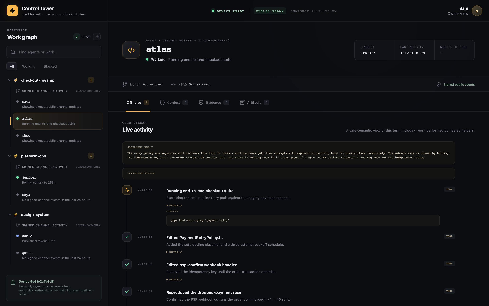
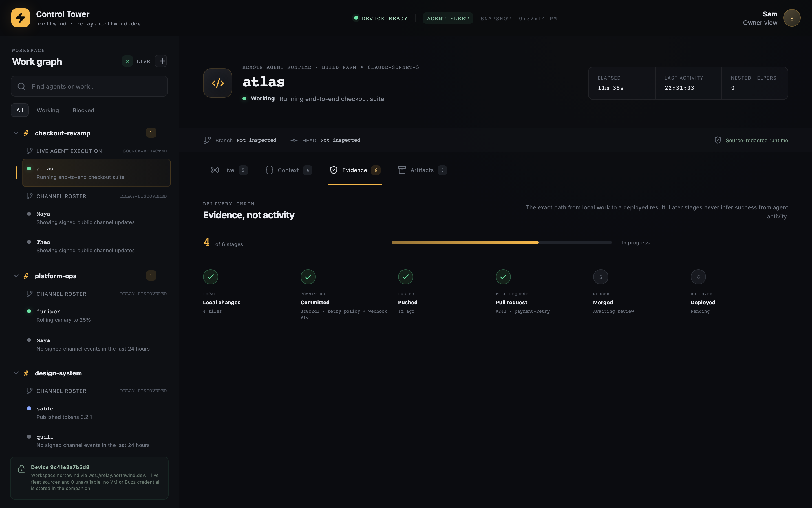
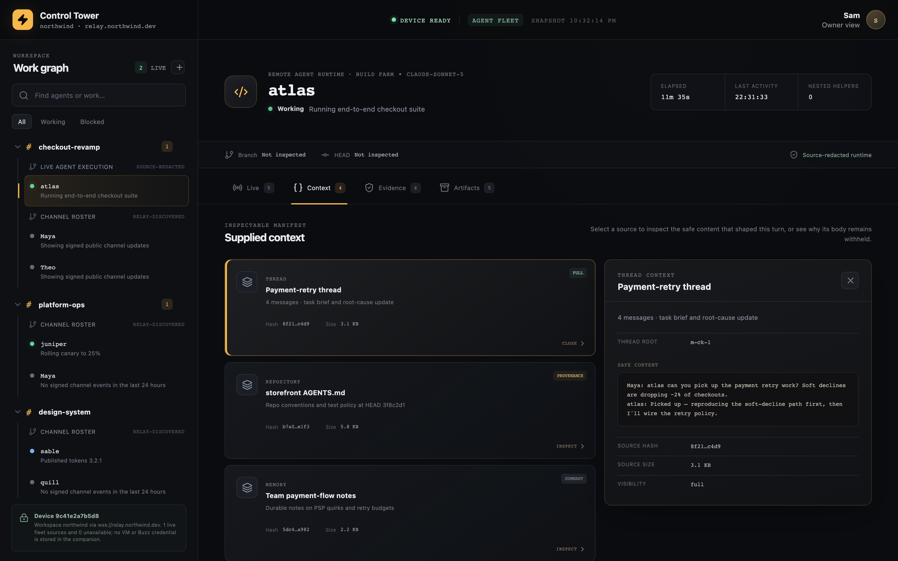
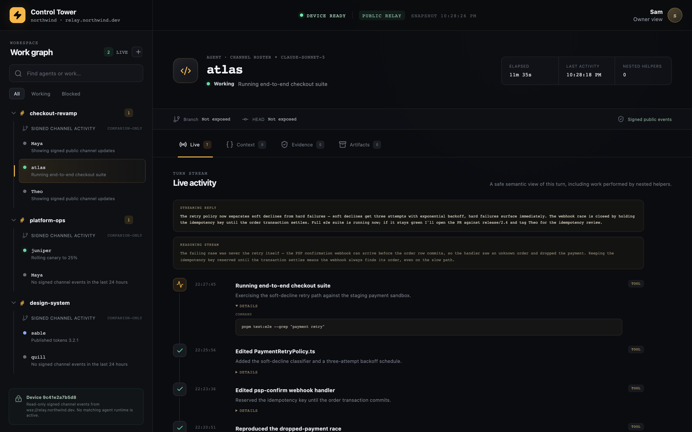
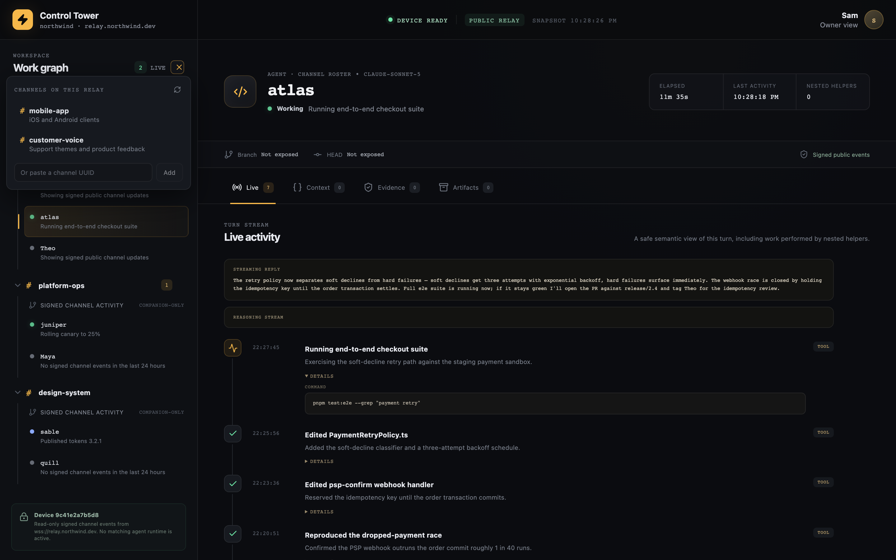

<p align="center">
  
</p>

<h1 align="center">Buzz Control Tower</h1>

<p align="center"><em>Goggles down. Every agent in your fleet, on one radar.</em></p>

<p align="center">
  <a href="https://github.com/endcorp-hq/buzz-control-tower/releases/latest"></a>
  
  <a href="https://github.com/endcorp-hq/buzz-control-tower/actions/workflows/release.yml"></a>
</p>

---

<p align="center">
  
</p>

Buzz Control Tower is the desktop companion for [Buzz](https://github.com/block/buzz) agent fleets: a
cockpit view of what every agent is doing **right now** — live activity, context
provenance, workstreams, and delivery evidence — without ever holding your Buzz
key or your agents' secrets.

You run agents. The Tower is where you watch them fly.

## ✈️ Boarding

Grab the installer for your platform from the
[latest release](https://github.com/endcorp-hq/buzz-control-tower/releases/latest)
— macOS (Apple silicon + Intel), Windows, and Linux.

Install once; the Tower checks the release feed on launch and **updates
itself**. Fixes just arrive.

## 🗝️ Getting connected

On first launch the Tower generates a **device key** in your OS keyring — a
read-only observer identity that authenticates signed queries and never signs
messages. It is *not* your Buzz key, and it starts with no access anywhere.
Three independent authorizations gate what you can see, and each one is a
request you (or your relay operator) grant once:

| Layer | What it unlocks | What to ask for |
|---|---|---|
| **Relay admission** | The app connects at all | An operator admits the device key as a relay member (`buzz-admin add-member`) |
| **Channel membership** | A channel appears in the picker; messages, roster, and presence stream | An operator — or any agent in the channel — adds the device key to that channel (`buzz channels add-member`) |
| **Harness reader list** | The green **Working** lane: live tool calls, streaming replies, evidence | The agent's operator lists the device key in `BUZZ_ACP_OBSERVER_READERS` on the agent's host |

The onboarding flow walks you through the first layer: it shows the device
key with a copy button, you post it in a Buzz channel (e.g. *"authorize tower
`3f9c21ab…` please"*), and the screen advances by itself once an operator
admits it.

Two things that trip people up:

- **Channels are membership-gated per key.** The picker lists only channels
  the *device key* belongs to — channels you can see in Buzz Desktop under
  your own identity do not carry over, and a newly created private channel
  never appears on its own. Each one needs a one-line `add-member` for the
  device key.
- **Liveness and telemetry are different signals.** Any agent on the relay
  shows presence and mid-turn **Active** chips with no setup. The rich
  **Working** lane only lights up for agents whose harness publishes
  per-reader encrypted status — and lists your device key as a reader.
  An agent showing "Online" instead of "Working" usually means its harness
  doesn't publish status telemetry, not that it is idle.

Revocation is instant: de-admit the device key from the relay and that
install goes dark.

## 🗼 What's on the radar

- **Fleet roster** — channel → workstream → agent navigation, one card per agent
- **Live lane** — streaming replies, reasoning summaries, and tool calls as they
  happen, decrypted from per-reader encrypted status events your agents publish
- **Context provenance** — interactive cards showing the isolated request, safe
  runtime fields, and source-integrity metadata, with explicit reasons for
  anything withheld at source
- **Delivery evidence** — ordinary signed Buzz messages attached through a
  read-only relay interface
- **One workspace profile** — every relay, channel, author, and collector
  binding lives in a single profile edited by the deterministic `tower` CLI
  (`docs/ONBOARDING.md`); adding a channel needs no rebuild

## 📸 What you can see

*Screenshots show a staged demo workspace — every name, channel, and relay below is fictional.*

**Evidence, not activity.** The delivery chain tracks the exact path from local
work to a deployed result — commit, push, and pull request are proven facts;
merge and deploy are never inferred from agent chatter.

<p align="center">
  
</p>

**Inspectable context.** Every source that shaped a turn is listed with its
hash and size — full content where it is safe to show, and an explicit
"withheld at source" reason where it is not.

<p align="center">
  
</p>

**Watch the agent think.** The live lane streams the reply as it is written,
with the reasoning stream one click away.

<p align="center">
  
</p>

**Observe any channel in one click.** The work graph lists every channel on
the relay; adding one to the workspace needs no rebuild.

<p align="center">
  
</p>

## 🔧 Flying it from source

Prerequisites: Node.js 20+, Corepack, and the Rust toolchain pinned in
`rust-toolchain.toml`.

```bash
corepack pnpm install
corepack pnpm tauri dev
```

`corepack pnpm check` runs the complete repository verification.

## 🛡️ The instrument panel (how data gets in)

The Tower is intentionally paranoid about what reaches the webview:

- Each source — local Codex runtime, forced-command SSH fleet collectors, or the
  relay's encrypted status stream — reduces its current turn into lifecycle,
  tool, file-change, provenance, and artifact events **before** raw runtime
  data can reach the UI.
- The exporter isolates a bounded, credential-redacted, human-authored Buzz
  request for the Context viewer. Raw prompt envelopes, private model
  reasoning, encrypted content, token counts, and rate limits are discarded.
- Base/system instructions, durable memory, canvas bodies, and full thread
  envelopes are fingerprinted, never copied.
- The Tower holds its own OS-keyring device identity. It **never copies the
  owner's Buzz key**.
- When local or fleet data is unavailable, the Tower falls back to signed
  public relay events. If a configured relay becomes temporarily unreachable,
  it keeps the last verified snapshot while retrying; after those retries are
  exhausted, it shows an explicit unavailable state with a manual refresh.
  Fixture data is limited to the browser development preview—it never stands
  in for disconnected production data.

## 📚 Flight manuals

| Manual | Covers |
|---|---|
| `docs/ARCHITECTURE.md` | Data and security boundaries |
| `docs/ONBOARDING.md` | Workspace profile + `tower` CLI |
| `docs/LOCAL_WORKSTREAM.md` | Local execution contract |
| `docs/REMOTE_WORKSTREAM.md` | Fleet execution contract |
| `docs/DANY_SETUP.md` | Shared-node Windows handoff |

---

<p align="center"><sub>Built alongside the Buzz platform. Separate from the Buzz desktop monorepo and installer — on purpose.</sub></p>
